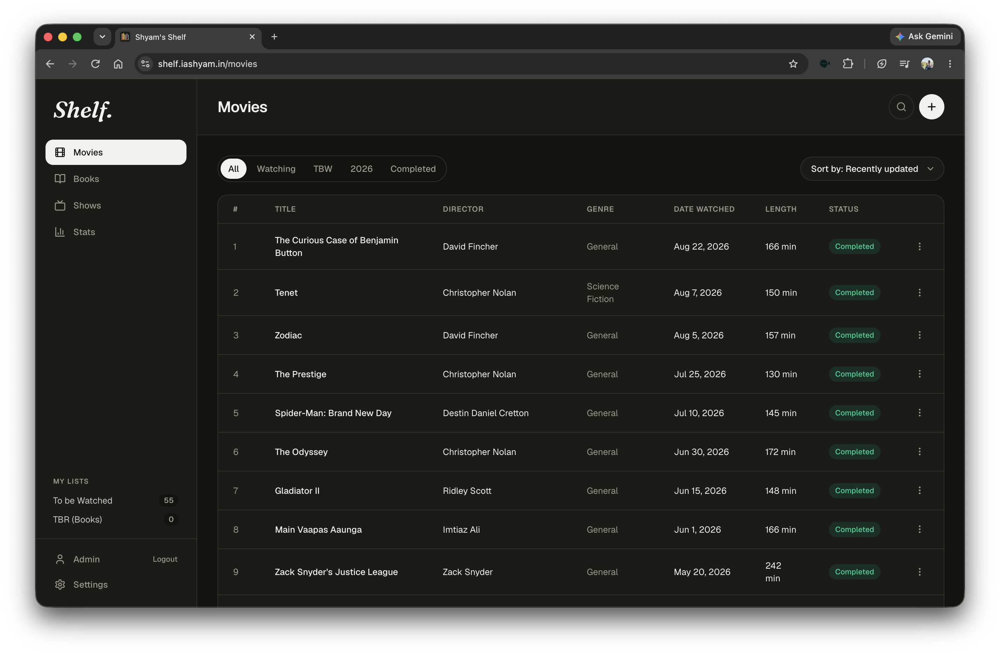

# Books-Movies

This is just a simple webpage to keep track of all the books I have read and all the movies I have watched. This is written in Golang and Have a pretty simple design. This is like the first thing you should learn when you do backend development. 

I haven't used any AI coding agent in developement of this project. There is nothing in this to be used the Agent for. This is a very simple project with literally no complexity. But that's not the reason I haven't used any AI tool. The real is greater than that. The real is: The weekly limit for the Claude is exhausted.

The framework used in the backend is Go-gin, the databse in mongodb.There is no perticular reason to choose this, except just I wanted it this way. The fronted is build using pure HTML and CSS, but then I decided to make a cool frontend dashboard using Claude and it's awesome. And I also now how to make backends in Go. Next I will focus on logging in Go. 

This is available [here](shelf.iashyam.in).

Contributions: There is nothing to add dude. This is purely for me. If you want you can copy this, for better if you can ask your AI agent to write a better tool.
